# AlphaGo定式研究

本文内容来自黄士杰博士的facebook[https://www.facebook.com/aja.huang](https://www.facebook.com/aja.huang), 版权属于原作者。  

[大雪崩](#link1)  
[妖刀](#link2)  
[大斜](#link3)  

## 大雪崩

大雪崩定式是三大難解定式之一，圖1是最常見的變化之一。不過，AlphaGo認為大雪崩定式無論怎麼下，圖1的黑棋都不好，因此AlphaGo並不會下大雪崩定式，而會採取圖2的下法。那麼，如果我們強迫AlphaGo下大雪崩定式會如何呢？圖3是AlphaGo所認為黑棋的最佳下法。有別於傳統定式的2路拐，AlphaGo認為在1位單長就可以了，接下來形成兩種可能的變化，即圖4與圖5，黑棋可以將局面的不利減到最小。  
值得注意的是，AlphaGo認為一般情況下白棋內拐比外拐更好，而年初AlphaGo與羋昱廷九段所下出的外拐，是針對當時局面的場合下法。  

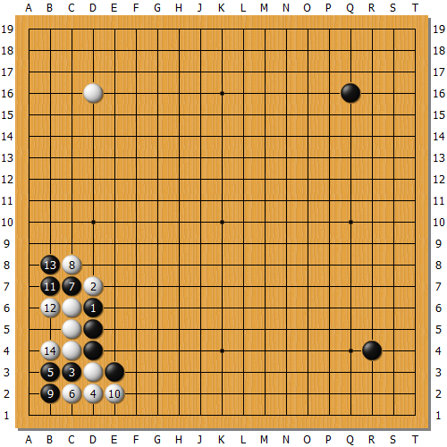  
图1: 這是傳統的大雪崩定式的常見變化之一。  

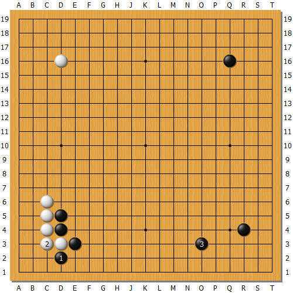  
图2: AlphaGo認為大雪崩定式無論怎麼下，圖1的黑棋都不好，因此AlphaGo並不會下大雪崩定式，而會採取本圖的下法。  

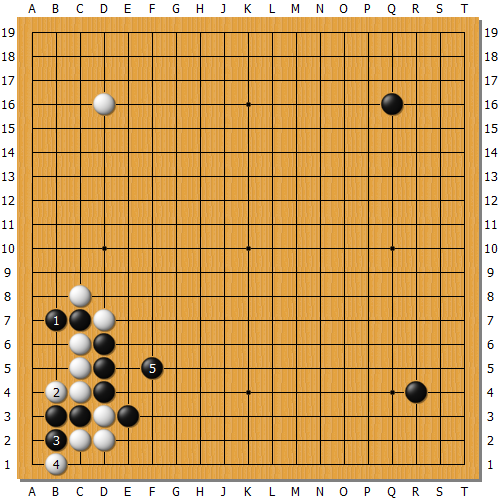  
图3: 如果我們強迫AlphaGo下大雪崩定式會如何呢？本圖是AlphaGo所認為黑棋的最佳下法。有別於傳統定式的2路拐，AlphaGo認為在1位單長就可以了。  

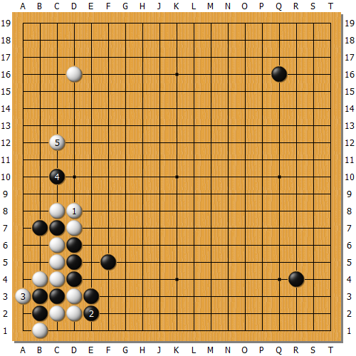  
图4: 接下來形成兩種可能的變化之一，黑棋可以將局面的不利減到最小。  

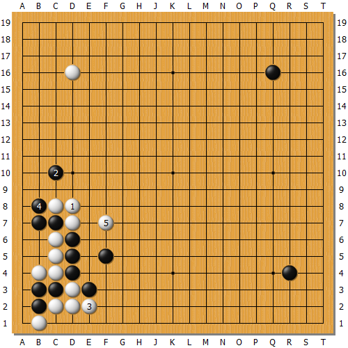  
图5: 接下來形成兩種可能的變化之一，黑棋可以將局面的不利減到最小。  

## 妖刀
圖1就是妖刀定式的基本型。在Master與職業棋士的對局中出現過圖2的變化，AlphaGo認為白4靠不好，至黑19拆邊，白棋的勝率下降近15個百分點。圖3是AlphaGo所認為的雙方最佳下法。如果圖3中的黑5選擇圖4的擋下，至白12將形成戰鬥，AlphaGo認為白棋稍微有利。

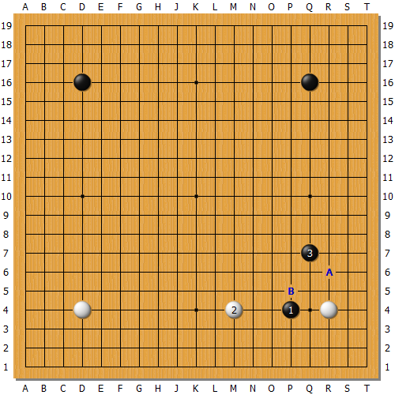  
图1: 這是妖刀定式的基本型。  

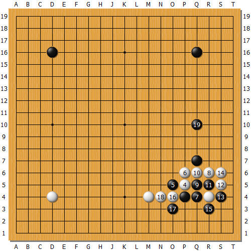  
图2: AlphaGo認為白4靠不好，至黑19拆邊，白棋的勝率下降近15個百分點。  

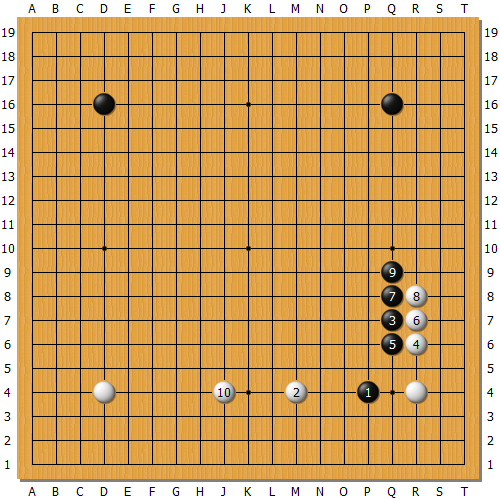  
图3: AlphaGo所認為妖刀定式的雙方最佳下法。  

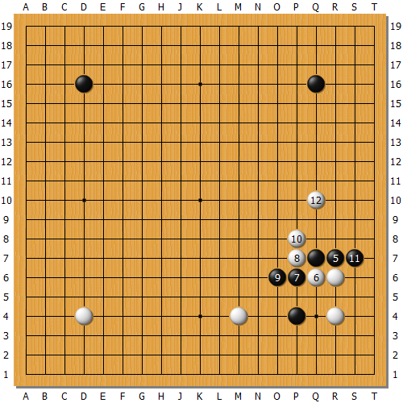  
图4: 如果黑5選擇擋下，至白12將形成戰鬥，AlphaGo認為白棋稍微有利。  

## 大斜

圖1是大斜定式的基本型。簡單來說，在一般的情況下AlphaGo認為大斜不如A位飛壓，所以AlphaGo並不會下大斜定式。在這個局面，AlphaGo會選擇圖2的下法。不過，在三間低夾的情況下(圖3)，AlphaGo是會下大斜的，這個局部的棋形在Master與職業棋士的對局中也出現過。接下來形成很多種可能的變化，圖4至圖7都是AlphaGo所認為雙方可能的下法，並且AlphaGo都認為雙方均勢。其中，圖6與圖7的黑8扳再黑10擋是AlphaGo所強調的手段。在圖3的局面如果黑棋選擇尖頂，會形成圖8的變化，AlphaGo認為白棋稍好。圖5的黑7如果扳，則會形成圖9的變化，AlphaGo認為黑棋稍差。

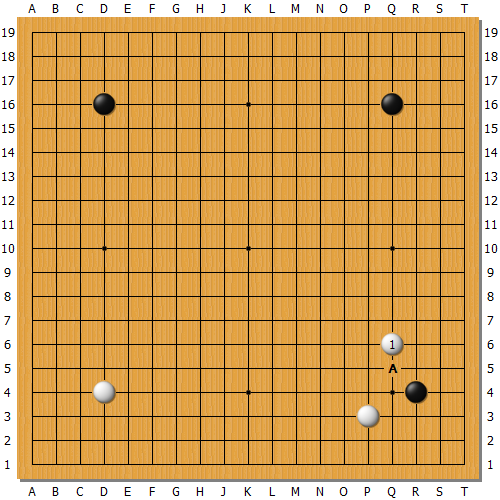  
图1: 這是大斜定式的基本型。簡單來說，在一般的情況下AlphaGo認為大斜不如A位飛壓，所以AlphaGo並不會下大斜定式。在這個局面，AlphaGo會選擇圖2的下法。  

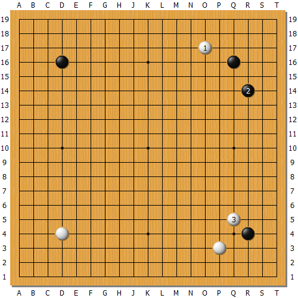  
图2: 這是AlphaGo會選擇的下法。  

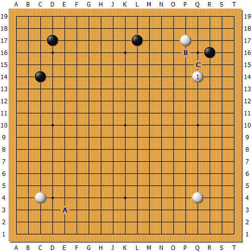  
图3: 在三間低夾的情況下，AlphaGo是會下大斜的，這個局部的棋形在Master與職業棋士的對局中也出現過。接下來形成很多種可能的變化。  

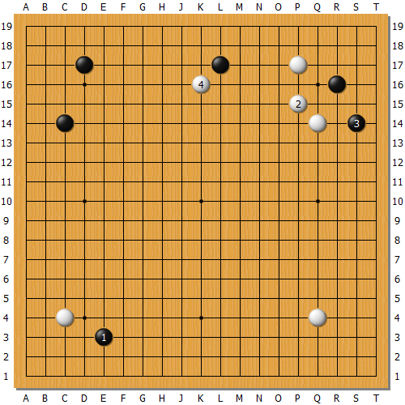  
图4: AlphaGo所認為雙方可能的下法之一，雙方均勢。  

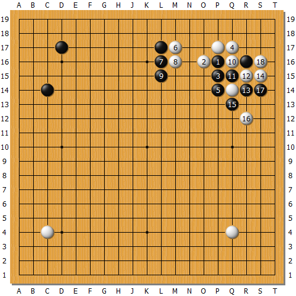  
图5: AlphaGo所認為雙方可能的下法之一，雙方均勢。  

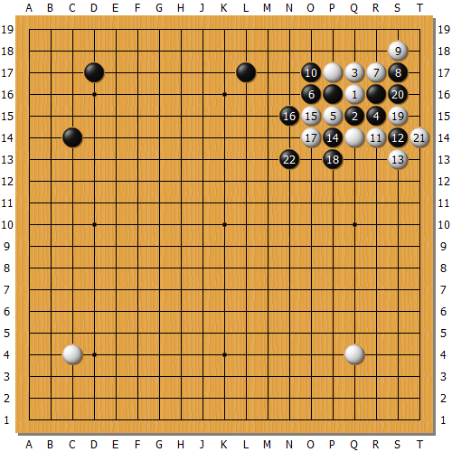  
图6: AlphaGo所認為雙方可能的下法之一，雙方均勢。黑8扳再黑10擋是AlphaGo所強調的手段。  

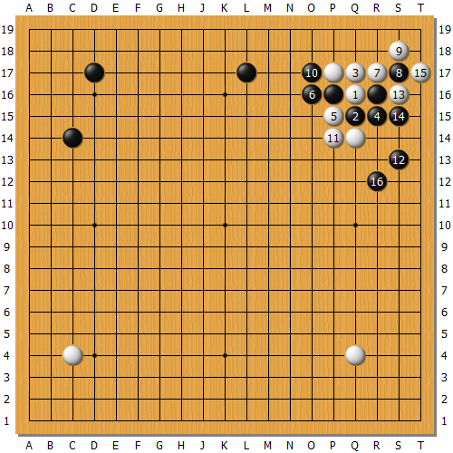  
图7: AlphaGo所認為雙方可能的下法之一，雙方均勢。黑8扳再黑10擋是AlphaGo所強調的手段。  

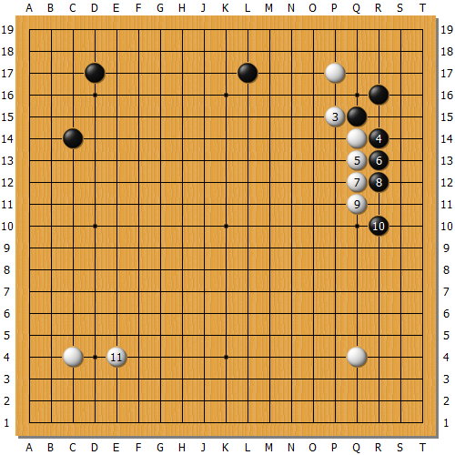  
图8: 如果黑棋選擇尖頂，AlphaGo認為白棋稍好。。  

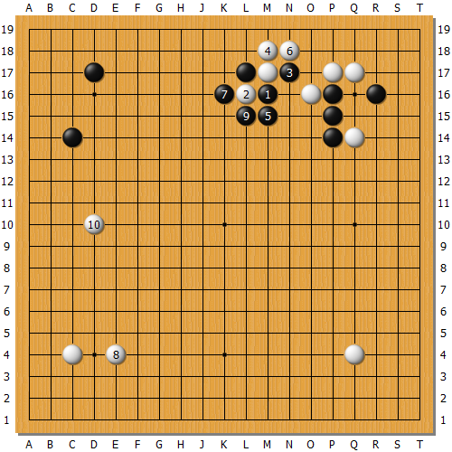  
图9: AlphaGo認為黑棋稍差。  
